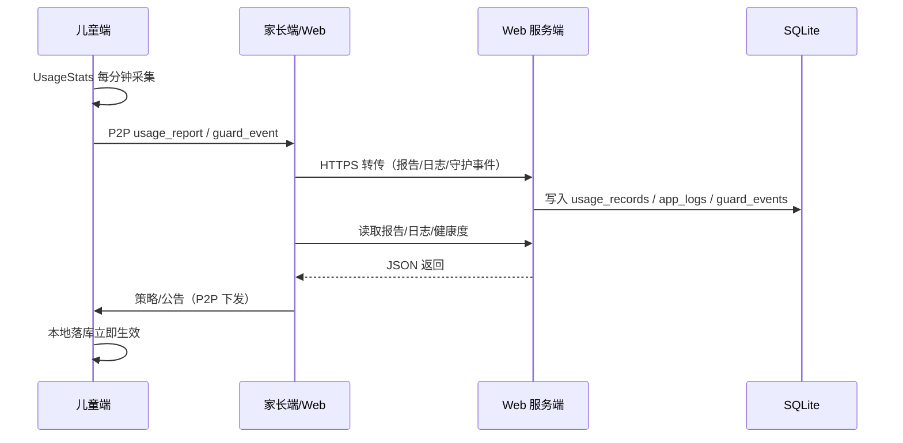
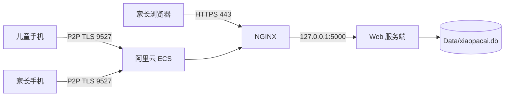
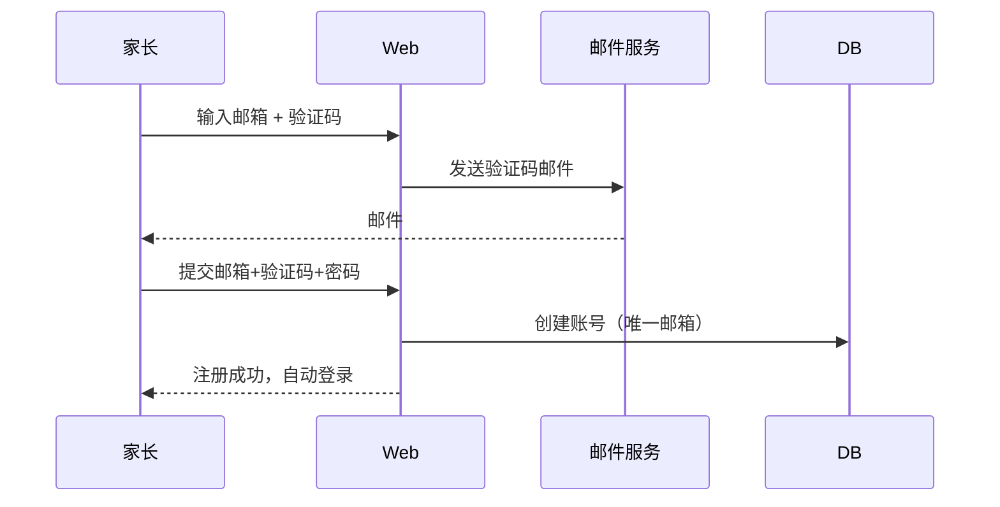
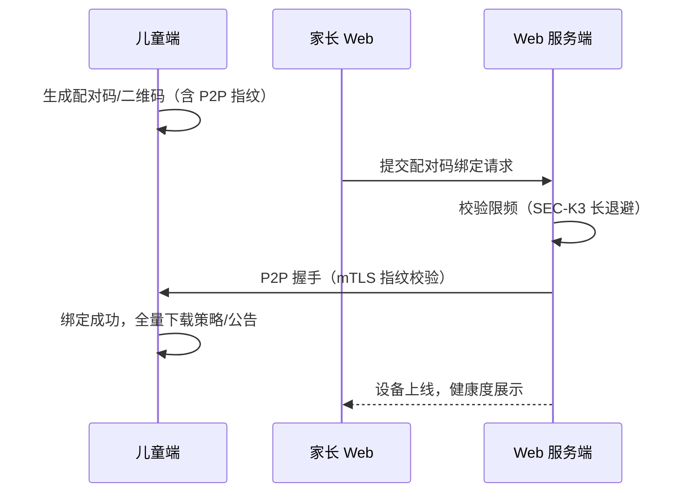
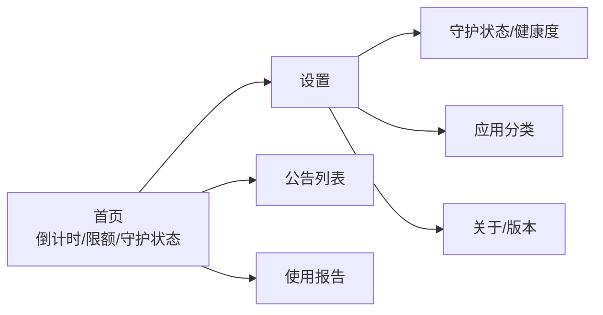
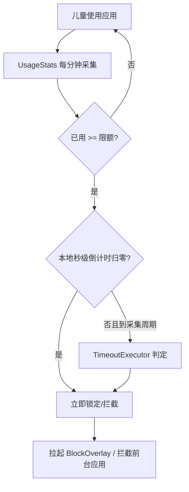
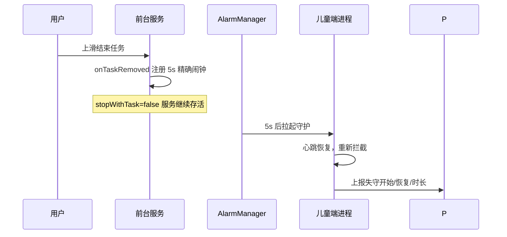
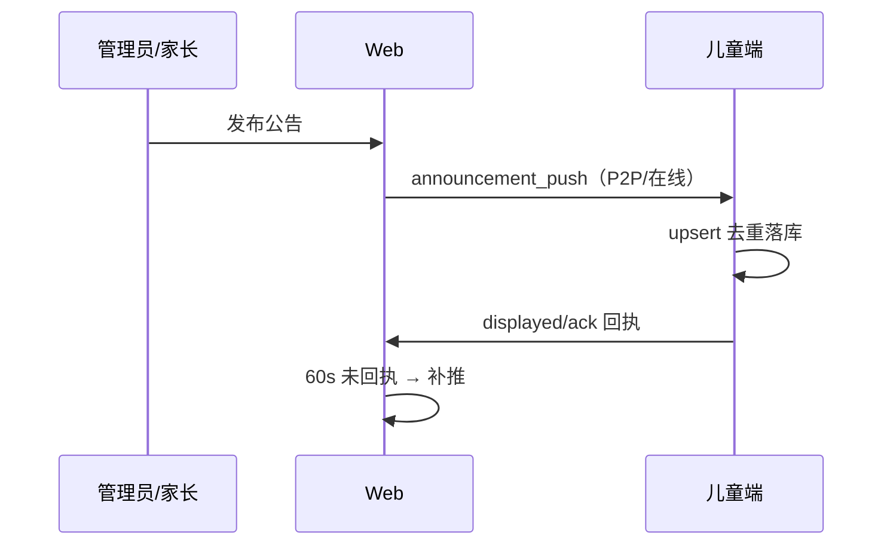
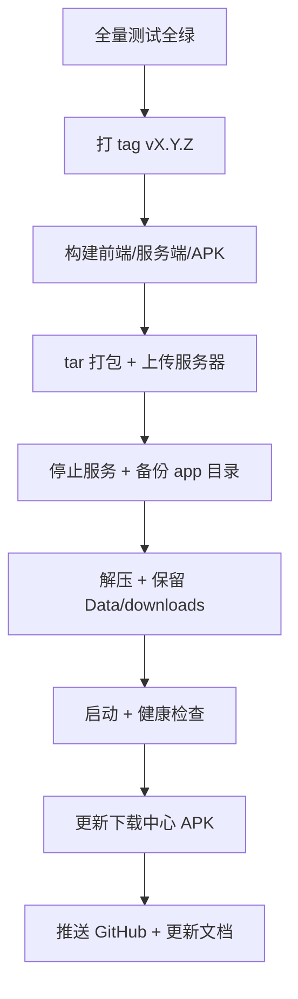

# 🥬 小趴菜系统说明书

> **儿童守护 · 家长监控软件**  
> 版本：v1.1.1（Android）/ 3.0.0 系（Web 服务端）  
> 更新日期：2026-08-15  
> 适用对象：家长用户、管理员、实施/运维人员、二次开发者  
> 仓库：
> - 客户端（Android/Windows）：`github.com/winann-xu/xiaopacai`
> - 服务端（Web/API）：`github.com/winann-xu/xiaopacai-web`

---

## 目录

1. [产品概述](#1-产品概述)
2. [系统架构](#2-系统架构)
3. [部署环境与拓扑](#3-部署环境与拓扑)
4. [账号与权限体系](#4-账号与权限体系)
5. [Web 家长端功能](#5-web-家长端功能)
6. [管理后台功能](#6-管理后台功能)
7. [Android 儿童端功能](#7-android-儿童端功能)
8. [守护机制详解](#8-守护机制详解)
9. [公告与策略同步机制](#9-公告与策略同步机制)
10. [日志与健康度体系](#10-日志与健康度体系)
11. [安全设计](#11-安全设计)
12. [部署、升级与回滚](#12-部署升级与回滚)
13. [运维与监控](#13-运维与监控)
14. [测试与发布流程](#14-测试与发布流程)
15. [常见问题 FAQ](#15-常见问题-faq)
16. [附录](#16-附录)

---

## 1. 产品概述

### 1.1 一句话介绍

小趴菜是一款帮助家长管理少年儿童手机/平板使用时长的守护软件：家长设定每日限额、就寝时段、应用白名单与公告，儿童端在超时后自动拦截被管控应用或整机停用；所有数据本地加密存储、P2P 加密传输，公网仅用于账号验证与云端中继。

### 1.2 目标用户

| 角色 | 说明 |
|---|---|
| 家长 | 通过 Web/Android 家长端管理孩子设备、查看报告 |
| 儿童 | 使用 Android 儿童端，受策略守护 |
| 管理员 | 账号管理、系统设置、日志全量查看、邮件配置 |
| 运维 | 部署、升级、备份、巡检、排障 |

### 1.3 产品原则

- **开源免费**：Apache-2.0。
- **本地优先**：策略、公告、使用记录落本地加密库，离线不影响已下发内容执行。
- **数据不上云**：P2P 数据通道仅做家长-儿童设备直连/中继，账号验证走 HTTPS。
- **边界诚实**：不夸大 Android 平台能力，明确“无障碍服务不可自动重开、强停不可自恢复”等边界并配套告警。

### 1.4 版本说明

| 组件 | 版本 | 说明 |
|---|---|---|
| Android 儿童/家长端 | v1.1.1（versionCode 10101） | 版本号由 Git tag 自动推导 |
| Web 服务端/前端 | 3.0.0 系（v1.1.1 配套） | .NET 8 + Vue 3 |
| Windows 家长端 | 1.0.0 系 | 与 v1.1.1 无功能冲突，本轮未改动 |

---

## 2. 系统架构

### 2.1 总体架构

```mermaid
flowchart TB
    subgraph 家庭侧
        CHILD[Android 儿童端<br/>Kotlin + Compose]
        PARENT_APP[Android/Windows 家长端<br/>P2P 客户端]
    end

    subgraph 公网（阿里云）
        NGINX[nginx 443 HTTPS]
        WEB[Web 服务端 .NET 8<br/>Kestrel :5000]
        P2P[P2P 中继 TLS :9527]
        DB[(SQLite<br/>Data/xiaopacai.db)]
    end

    PARENT_WEB[家长浏览器<br/>Vue 3 前端]

    CHILD <-->|P2P TLS 双向认证| P2P
    PARENT_APP <-->|P2P TLS 双向认证| P2P
    PARENT_WEB <-->|HTTPS JSON API| NGINX
    NGINX <--> WEB
    WEB <--> DB
    WEB --> P2P
```

### 2.2 组件清单

| 组件 | 技术 | 职责 |
|---|---|---|
| Web 服务端 | ASP.NET Core 8 / EF Core / SQLite | 账号、策略、公告、报告、日志、守护事件、审计 |
| Web 前端 | Vue 3 + TypeScript + Element Plus + ECharts | 家长端页面、管理后台、下载中心 |
| Android 儿童端 | Kotlin + Jetpack Compose + Room + SQLCipher | 时长采集、超时拦截、公告展示、守护自愈 |
| Android 家长端 | 同上（双角色） | 扫码绑定、策略编辑、报告、日志、健康度 |
| Windows 家长端 | C# / WPF / .NET 8 | 局域网 P2P 直连家长端 |
| nginx | 反向代理 | 80→443 跳转、HTTPS 终止、反代 5000 |
| P2P 通道 | TLS 1.2/1.3 + 证书指纹 | 家长-儿童双向认证、策略/公告/事件传输 |

### 2.3 端口

| 端口 | 服务 | 暴露范围 |
|---|---|---|
| 443 | nginx HTTPS | 公网 |
| 80 | nginx HTTP→HTTPS | 公网（301） |
| 5000 | Kestrel Web API | 仅本机回环（nginx 反代） |
| 9527 | P2P TLS | 公网（mTLS 双向认证） |

### 2.4 核心数据流



---

## 3. 部署环境与拓扑

### 3.1 生产环境

| 项目 | 值 |
|---|---|
| 云服务器 | 阿里云 ECS（香港/国际线路），8.217.165.122 |
| 系统 | Ubuntu（root），systemd |
| 域名 | `https://xpc.winann.com`（A 记录 → 服务器） |
| 证书 | Let's Encrypt ECC，acme.sh 自动续期 |
| 部署目录 | `/opt/xiaopacai/app` |
| 环境变量 | `/etc/xiaopacai-web.env`（root 0600，勿覆盖） |
| 服务 | `xiaopacai-web`（systemd，自启动） |

### 3.2 生产目录结构

```text
/opt/xiaopacai/app/
├── XiaopacaiWeb / XiaopacaiWeb.dll
├── wwwroot/
│   ├── index.html / assets/          # Vue 构建产物
│   └── downloads/                    # 下载中心 APK
├── Data/
│   ├── xiaopacai.db                  # 业务数据库
│   ├── certs/                        # P2P TLS 证书
│   └── .dbkey（加密库时存在）
├── appsettings*.json
├── docs/                             # 运维手册/说明书
└── app.bak-YYYYMMDD-HHMMSS/          # 升级前备份
```

### 3.3 拓扑示意



---

## 4. 账号与权限体系

### 4.1 账号模型（v1.0 账号体系重构后）

- **一个用户一个账号**：Android 家长端/儿童端/Web/Windows 共用邮箱账号体系。
- **邮箱注册**：必须使用邮箱；验证码注册、登录、找回密码。
- **儿童端归属**：儿童端必须绑定到某个家长在线账号，才能统一管理。
- **离线语义**：账号离线不影响已下发策略与公告；离线仅停止同步。
- **家长端安全**：切到儿童端或程序退出后再进家长端，必须输入密码；儿童端系统级菜单必须密码。

### 4.2 角色

| 角色 | 能力摘要 |
|---|---|
| parent | 绑定/管理儿童设备、策略、公告、报告、日志（本账号） |
| admin | 全部家长能力 + 账号管理、系统设置、邮件配置、全量日志/守护事件 |

### 4.3 登录与鉴权

- Web：`POST /api/auth/login`（账号密码）→ JWT accessToken + httpOnly refresh cookie。
- 验证码：`POST /api/auth/email-code`（purpose：register/login/reset_password）。
- 找回：`POST /api/auth/password-reset`。
- 家长端 Android：登录后持 token 调 API；P2P 通道独立 mTLS。



---

## 5. Web 家长端功能

### 5.1 页面总览

| 页面 | 功能 |
|---|---|
| 仪表盘 | 在线设备、今日汇总、超时统计、实时刷新 |
| 设备管理 | 设备列表、扫码配对、绑定/解绑、连接状态、证书指纹、守护健康度 |
| 策略配置 | 每日限额、就寝时段、白名单/黑名单、超时处理、重置当日限额 |
| 公告管理 | 新建/编辑/发布/撤回/删除、优先级、有效期、实时推送 |
| 使用报告 | 日报/周报、趋势图、分类占比、导出 TXT/JSON/CSV |
| 运行日志 | 本账号设备日志（时间+接收时间）、上传状态 |
| 设置 | 账号密码、通知、邮箱配置（admin） |
| 下载中心 | 公网 APK 下载（arm64/v7a/x86_64） |

### 5.2 设备管理

扫码绑定流程：



### 5.3 策略配置

- 每日限额：默认 120 分钟 / full_lock（可调）。
- 超时动作：`full`（整机停用）/ `partial`（娱乐类应用停用）。
- 白名单：超时后仍可用应用。
- 就寝时段：夜间自动停用。
- 分类限额：后端保留，前端标注“暂不可用”（本期未启用）。
- 重置：家长可重置当日限额（重置前分钟数不计入）。

### 5.4 使用报告

- 数据口径：与儿童端采集器一致（前台活跃使用时间）。
- 统计分类：回归到终端分类，不限制在四大类。
- 报告同步：APP 报告页与 Web 同源（在线实时拉取，离线本地缓存标注）。

---

## 6. 管理后台功能

### 6.1 账号与权限

- 创建/停用家长账号；admin 固定邮箱账号。
- 角色鉴权：普通家长仅本账号数据；admin 全量。

### 6.2 系统设置与邮件配置

| 接口 | 说明 |
|---|---|
| `GET/PUT /api/admin/mail-config` | 查看/保存 SMTP/API 邮件通道（Secret 加密，不回显） |
| `POST /api/admin/mail-config/test` | 发送测试邮件 |

### 6.3 日志与守护事件（admin 全量）

- `app_logs`：家长端/儿童端运行日志，账号隔离，admin 全量，7 天保留。
- `guard_events`：失守/恢复事件与健康度快照，admin 全量。

---

## 7. Android 儿童端功能

### 7.1 功能清单

| 模块 | 说明 |
|---|---|
| 时长采集 | UsageStatsManager 每分钟采集，前台活跃口径 |
| 超时拦截 | TimeoutExecutor + 无障碍服务识别前台应用并拉起拦截页 |
| 倒计时 | 首页 HH:MM:SS 逐秒刷新，归零立即锁定 |
| 公告 | 普通公告通知/列表；紧急公告全屏置顶，需确认 |
| 守护自愈 | 事件+定时双触发自检；上滑后 5 秒 Alarm 恢复 |
| 失守监控 | GuardDownMonitor 记录失守起止/时长并上报 |
| 家长端 | 扫码绑定、策略/公告编辑、报告、日志上传、健康度 |

### 7.2 权限清单

| 权限 | 用途 |
|---|---|
| 使用情况访问 | 时长采集（核心） |
| 无障碍服务 | 前台应用识别与超时拦截 |
| 设备管理员 | 防卸载（原生系统禁用强制停止按钮） |
| 悬浮窗 | 超时锁定界面 |
| 通知 | 公告与安全告警 |
| 电池优化白名单 | OEM 保活 |
| 自启动/后台冻结 | OPPO 保活四项（引导项） |

### 7.3 儿童端页面



---

## 8. 守护机制详解

### 8.1 超时锁定流程



### 8.2 上滑杀进程后的恢复（Bug1 修复）



### 8.3 失守监控（1-D）

- 检测：心跳（60s）+ 事件（回前台/解锁/开机/应用更新）。
- 判定：心跳间隔 > 5 分钟 = 曾被杀死。
- 上报：`guard_event` 经 P2P → 家长端本地落盘 → 云端转传 `/api/guard-events`。
- 恢复：恢复后立即重拦截并通知家长（id 4001）。
- 展示：家长端“守护状态”页 + Web 设备详情（score/100、6 项勾叉、失守历史）。

### 8.4 平台边界（如实说明，不夸大）

| 场景 | 事实 | 缓解 |
|---|---|---|
| 上滑最近任务 | 服务可继续存活（stopWithTask=false） | 5s Alarm 兜底 + 失守上报 |
| 设置-强制停止 | 原生系统对设备管理器 App 禁用该按钮 | OEM 差异靠健康度告警 |
| `am force-stop`/OEM 强杀 | 进程/闹钟/WorkManager 全失效，无法自启 | 打开 App 即恢复 + 家长告警 |
| 无障碍被系统移除 | 第三方 App 无法自动重开 | 高优通知 + 一键直达设置 |
| OPPO 熄屏清理 | 会杀无障碍/后台服务 | 自启动/后台冻结/电池白名单/最近任务锁定 |
| 绝对免杀 | 普通 App 不可能（Android 平台限制） | Device Owner 是唯一官方路径，OPPO 新机需企业定制，本期仅检测说明 |

---

## 9. 公告与策略同步机制

### 9.1 同步原则

- 服务端为权威；任意一端修改，全端一致。
- 离线修改挂起重连补推；恢复后增量同步 + 补报。
- 多端冲突按版本/时间戳校验，服务端最新版本优先。

### 9.2 公告处理

| 场景 | 处置 |
|---|---|
| 发布普通公告 | 即时推送 + 系统通知 + 列表展示 |
| 发布紧急公告 | 全屏置顶 + 必须确认；60s 未 displayed 补偿重推 |
| 重复下发 | 终端有已读/已确认记录；已显示过的公告不再次显示（upsert 去重） |
| 撤回/删除 | 本地置过期；删除时下发“清除本地公告”指令 |
| 账号隔离 | 公告归账号，同账号所有设备可见 |



---

## 10. 日志与健康度体系

### 10.1 运行日志（app_logs）

- 客户端写本地环形缓冲（上限 5000 条），脱敏后上传。
- 上传时机：登录/绑定成功立即传；失败 5/15/60 分钟指数退避；WorkManager 6 小时兜底。
- Web 端：`/api/logs` 查询，账号隔离；admin 全量；7 天保留。
- 表名一致性：`AppLogEntry` 显式 `ToTable("app_logs")`（v1.1.1 修复“no such table”500）。

```mermaid
flowchart LR
    APP[儿童/家长端] -->|登录即传/退避重试| API[/api/logs]
    API --> DB[(app_logs)]
    DB --> WEB[Web 日志页<br/>家长本账号/admin 全量]
```

### 10.2 守护健康度（guard_events）

- 快照字段：无障碍/使用情况访问/设备管理员/通知/前台服务/电量优化（6 项）。
- score：0–100；失守历史含开始/恢复/时长。
- 无数据时如实显示“待上报”。

---

## 11. 安全设计

### 11.1 红线

- 验证码/密码/令牌/密钥不落明文、不写日志与日志上传。
- 公网唯一 HTTPS 通道；保留局域网 HTTP 回退（测试期开关已随 V3 移除）。
- 家长身份验证必须云端账号密码。

### 11.2 传输与存储

| 层 | 机制 |
|---|---|
| Web | HTTPS（Let's Encrypt + HSTS）、JWT + httpOnly Cookie |
| P2P | TLS 1.2/1.3 双向认证，证书指纹校验 |
| 本地库 | SQLCipher（Android）；生产 Web 库当前明文 SQLite（待加固 R6.2） |
| 邮件 | Resend SMTP 587/STARTTLS，密钥加密存储 |

### 11.3 限频

- 配对码：60s 长退避 + 10min 封顶（SEC-K3，已修复）。
- 验证码/登录：按 IP/小时 + 按邮箱/小时限频，审计留痕。

---

## 12. 部署、升级与回滚

### 12.1 构建

```powershell
# Web 前端
cd web; npm run build
# Web 服务端测试
C:\dotnet\dotnet test ..\tests\xiaopacai-web.Tests.csproj -c Release
# 服务端发布（Linux 自包含）
C:\dotnet\dotnet publish ..\server\xiaopacai-web.csproj -c Release -r linux-x64 --self-contained true
# Android（单测 + Release 签名）
cd ..\..\xiaopacai\android; .\gradlew.bat testDebugUnitTest assembleRelease
```

> 版本号由 Git tag 自动推导：v1.1.1 → versionCode 10101；发布前必须先打 tag。

### 12.2 升级流程



### 12.3 回滚

```bash
systemctl stop xiaopacai-web
# 确认备份完好后
cp -a /opt/xiaopacai/app.bak-$TS /opt/xiaopacai/app
systemctl start xiaopacai-web
```

> 回滚后若 P2P 指纹与备份库不一致，需重新配对。

---

## 13. 运维与监控

### 13.1 健康检查

```bash
curl -s https://xpc.winann.com/api/health
systemctl status xiaopacai-web
ss -tlnp | grep -E ':5000|:9527'
```

### 13.2 每日巡检（5 分钟）

- health 200；磁盘占用（`df -h`，重点 `/` 分区）。
- journalctl 无 Exception/Failed。
- 设备 LastSeen 更新；下载中心抽查 200。
- 守护事件无异常高频失守。

### 13.3 备份

- 升级前自动备份：`/opt/xiaopacai/app.bak-<时间戳>`。
- 建议每日 03:00 备份 `Data/` + 加密后异地。

### 13.4 监控建议

- systemd 探活 + health 探针（5 分钟）。
- 磁盘告警（>80%）。
- `guard_events` 高频失守告警。

---

## 14. 测试与发布流程

### 14.1 测试基线（v1.1.1）

| 套件 | 数量 | 状态 |
|---|---:|---|
| Web 单测 | 303 | 全绿 |
| Android 单测 | 154 | 全绿 |
| Windows 单测 | 15 | 全绿 |
| npm build | — | 通过 |

### 14.2 真机回归清单（OPPO 等国产机型）

1. 上滑结束小趴菜 → 5s 内守护恢复，家长端收到失守通知。
2. 倒计时逐秒刷新；限额 1 分钟观察归零立即锁定。
3. 关闭无障碍 → 高优通知 + 一键直达。
4. 家长端登录 → 日志自动上传，Web 可查。
5. 健康度（score + 6 项）与真机一致。

### 14.3 版本与协作

- 语义化版本；每次升级：CHANGELOG → tag → 构建验证 → 部署记录 → 推送 GitHub。
- 双 AI 协作：Claude（50.53）主开发，Codex（50.20）测试/集成/部署；任务走桥接信件 + git bundle。

---

## 15. 常见问题 FAQ

### 15.1 儿童端收不到公告？

1. 确认设备已绑定到发布者账号（账号隔离）。
2. 查看 Web 公告回执（displayed/ack）；60s 未回执会补推。
3. 检查通知权限；紧急公告走全屏。

### 15.2 限额到期但被管控应用还能用？

- 先看守护状态页健康度：无障碍/用量权限是否被关、服务是否被杀。
- OPPO 需开启自启动/后台冻结白名单/电池不优化/最近任务锁定。
- 若刚上滑过小趴菜，等待 5s 自动恢复；若被“强制停止”，需打开 App 恢复。

### 15.3 Web 日志页报错/查不到日志？

- v1.1.1 已修复表映射（app_logs）。若仍报错，检查服务版本是否为 v1.1.1（`/api/health`）。
- 日志上传需家长端已登录；失败会 5/15/60 分钟退避重试。

### 15.4 邮箱验证码收不到？

- 查 Web 审计（`email_code_send_failed`）与邮件配置；`POST /api/admin/mail-config/test` 验证通道。
- Resend 测试模式仅可发到账户所有者邮箱；正式需完成发信域名验证（SPF/DKIM）。

### 15.5 可以完全防止孩子卸载/关闭守护吗？

- 不能 100%（Android 平台限制，Norton 亦然）。设备管理员可防卸载；原生系统禁用强制停止按钮；OEM 需白名单；最强路径是 Device Owner（OPPO 新机需企业定制）。系统会检测、引导并如实告警。

### 15.6 离线影响使用吗？

- 不影响：已下发策略/公告本地照常执行；离线仅停止同步，恢复后增量补报。

### 15.7 如何重置管理员密码？

- 按管理员运维手册操作（生产库删除后重建会清空数据，需先备份）。

---

## 16. 附录

### 16.1 主要 API 摘要

| 方法 | 路径 | 说明 |
|---|---|---|
| GET | /api/health | 健康检查 |
| POST | /api/auth/login | 账号密码登录 |
| POST | /api/auth/email-code | 发送验证码 |
| POST | /api/auth/register | 邮箱注册 |
| POST | /api/auth/password-reset | 找回密码 |
| GET/POST | /api/logs | 日志查询/上传（账号隔离） |
| GET/POST | /api/guard-events | 守护事件查询/上报 |
| GET | /api/guard-events/health?deviceId= | 最新健康度 |
| GET/PUT/POST | /api/admin/mail-config* | 邮件配置（admin） |

### 16.2 主要数据表

| 表 | 用途 |
|---|---|
| users | 账号（邮箱唯一） |
| devices | 儿童设备（绑定/在线/指纹） |
| policies | 策略（限额/时段/黑白名单） |
| announcements / deliveries | 公告与送达/确认记录 |
| usage_records / daily_summary | 使用记录与日报 |
| app_logs | 运行日志（7 天） |
| guard_events | 守护失守/健康度（7 天） |
| audit_logs | 审计日志 |
| mail_config | 邮件通道配置（密钥加密） |

### 16.3 术语表

| 术语 | 含义 |
|---|---|
| P2P | 家长-儿童端 TLS 直连/中继通道 |
| mTLS | 双向证书认证 |
| 失守 | 守护进程/权限失效期间 |
| 健康度 | 6 项守护权限的综合得分（0–100） |
| full/partial | 整机停用/娱乐类应用停用 |
| upsert | 有则更新、无则插入（公告去重） |

### 16.4 参考文档

- 管理员运维手册：`ADMIN_OPS_MANUAL.md`
- 部署指南：`DEPLOY.md`
- 用户手册（Web）：`USER_MANUAL_WEB_PRODUCTION.md`
- 版本规范：`VERSIONING.md`
- ADR 0010–0016：架构决策记录

---

> 本文档随版本持续维护；每次发版后由 Codex 更新并同步至 GitHub 与阿里云 docs/。
